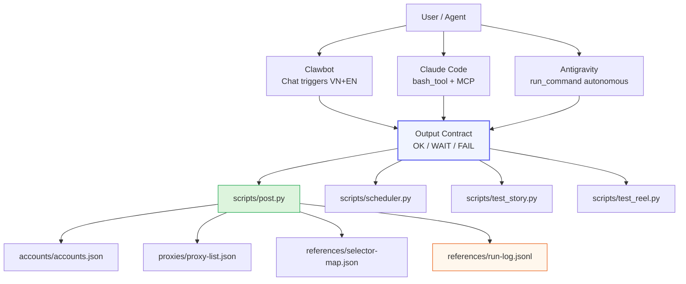

<div align="center">

# 🤖 Facebook Personal AI Automation

**Tự động đăng bài Facebook cá nhân bằng Playwright — không cần API, không cần app review.**

[](https://www.python.org/)
[](https://github.com/ptadigi/facebook-personal-ai-automation/actions/workflows/ci.yml)
[](LICENSE)
[](https://github.com/ptadigi/facebook-personal-ai-automation/commits/main)
[](tests/)

*Multi-account · Proxy support · Browser fingerprint spoofing · AI agent integration (Clawbot / Claude / Antigravity)*

</div>

---

## ✨ What It Does

Repo này cho phép bạn tự động đăng bài lên Facebook cá nhân bằng Playwright — giống như một người thật đang dùng trình duyệt Chrome. Không cần Facebook API, không cần app review, không cần page.

```
Bạn viết lệnh  →  Script mở Chrome headless  →  Đăng bài lên Facebook profile  →  Trả về URL bài đăng
```

**Hỗ trợ:**
- 📝 Bài viết (text + ảnh + video)
- 📸 Story (ảnh/video 24h)
- 🎬 Reel (short video)
- ⏰ Lên lịch đăng (`--schedule`)
- 👥 Nhiều tài khoản đồng thời
- 🌐 Proxy rotation
- 🤖 Tích hợp AI agent (Clawbot, Claude Code, Antigravity)

---

## 🎯 Who Is This For?

| Đối tượng | Use case |
|---|---|
| **Content creator / Influencer** | Lên lịch bài viết hàng tuần, đăng nhiều tài khoản cùng lúc |
| **Marketing team** | Batch scheduling, theo dõi post URL, kiểm tra rate limit |
| **Developer / AI engineer** | Tích hợp với AI agent pipeline, automation workflow |
| **Indie hacker** | Build micro-tool, SaaS nội bộ, cron job posting |

> ⚠️ **Chỉ dành cho tài khoản cá nhân của chính bạn.** Xem [Responsible Use](#-responsible-use--security).

---

## ⚡ Quickstart (5 phút)

```bash
# 1. Clone repo
git clone https://github.com/ptadigi/facebook-personal-ai-automation.git
cd facebook-personal-ai-automation

# 2. Cài đặt
pip install -r requirements.txt
playwright install chromium

# 3. Import cookies Facebook của bạn
#    (Dùng extension Cookie-Editor → Export → JSON)
python scripts/account_manager.py init \
  --id my_account \
  --cookies /path/to/my_cookies.json

# 4. Kiểm tra session
python scripts/account_manager.py test --id my_account
# Output: ✅ Account 'my_account' session is ACTIVE

# 5. Đăng bài đầu tiên
python scripts/post.py \
  --account my_account \
  --text "Chào mọi người từ AI automation! 🚀" \
  --auto-approve
# Output: OK: published | url: https://www.facebook.com/.../posts/... | account: my_account
```

**Hoặc dùng Make:**
```bash
make install       # pip install + playwright install
make test          # chạy 48 unit tests
make dom-learn     # học lại Facebook selectors
```

---

## 📤 Output Contract

Mọi command đều trả về **dòng cuối cùng stdout** theo format cố định:

```
OK: published | url: https://www.facebook.com/<user>/posts/<id> | account: <id>
OK: scheduled 2026-03-06T10:00:00+07:00
WAIT_APPROVAL
FAIL: AUTH_REQUIRED - <reason>
FAIL: DOM_CHANGED - <reason>
FAIL: RATE_LIMIT - <reason>
FAIL: PUBLISH_FAILED - <reason>
```

> Contract này **không bao giờ thay đổi** — backward compatible với mọi agent version.

---

## 🏗️ Architecture



---

## 📦 Features

| Feature | Status |
|---|---|
| Feed post (text / ảnh / video) | ✅ Production ready |
| Story post | ✅ Production ready |
| Reel post | ✅ Production ready |
| Scheduled posting (`--schedule`) | ✅ Production ready |
| Multi-account support | ✅ Production ready |
| Proxy rotation | ✅ Production ready |
| Browser fingerprint spoofing | ✅ Production ready |
| DOM self-healing (`dom_learner.py`) | ✅ Production ready |
| AI agent integration (3 agents) | ✅ Documented |
| Concurrent posting (ThreadPoolExecutor) | ✅ Production ready |
| Structured logging (JSONL) | ✅ Production ready |
| 48 unit tests + GitHub Actions CI | ✅ Active |

---

## 📖 Documentation

| Tài liệu | Mô tả |
|---|---|
| [docs/INDEX.md](docs/INDEX.md) | 📚 Central documentation map |
| [docs/USAGE_MULTI_AGENT.md](docs/USAGE_MULTI_AGENT.md) | Multi-agent setup guide |
| [docs/agent-guides/clawbot.md](docs/agent-guides/clawbot.md) | Clawbot integration |
| [docs/agent-guides/claude-code.md](docs/agent-guides/claude-code.md) | Claude Code integration |
| [docs/agent-guides/antigravity.md](docs/agent-guides/antigravity.md) | Antigravity integration |
| [docs/acceptance-tests/multi-agent-uat.md](docs/acceptance-tests/multi-agent-uat.md) | 26 UAT test cases |
| [docs/security-audit.md](docs/security-audit.md) | Full security audit (20 findings) |
| [docs/ROADMAP_NEXT_FEATURES.md](docs/ROADMAP_NEXT_FEATURES.md) | 15 planned features |
| [CHANGELOG.md](CHANGELOG.md) | Version history |
| [CONTRIBUTING.md](CONTRIBUTING.md) | How to contribute |

---

## 🔐 Responsible Use & Security

> **Đây là công cụ dành cho cá nhân, dùng với tài khoản của chính bạn.**

- ✅ Phù hợp: cá nhân muốn tự động hóa việc quản lý Facebook profile của họ
- ❌ Không phù hợp: spam, mạo danh, đăng nội dung vi phạm, commercial mass posting
- ⚠️ Sử dụng công cụ này có thể vi phạm [Facebook Terms of Service](https://www.facebook.com/terms). Người dùng chịu hoàn toàn trách nhiệm.

**Các biện pháp bảo mật tích hợp:**
- Cookie files có quyền `0o600` (chỉ owner đọc được)
- Sensitive data không được log
- `datr` cookie validation
- Browser fingerprint spoofing để giảm bot detection

Xem thêm: [SECURITY.md](SECURITY.md) và [docs/security-audit.md](docs/security-audit.md)

---

## 🚀 Roadmap Preview

**Quick Wins (đang lên kế hoạch):**
- [ ] F01: Adaptive rate-limit backoff (exponential + jitter)
- [ ] F02: Per-account log isolation
- [ ] F03: Proxy credential encryption (OS keyring)
- [ ] F04: DOM change alert webhook
- [ ] F05: `config.json` actually loaded and working

**Mid-term:**
- [ ] F06: HTTP health endpoint cho scheduler daemon
- [ ] F07: Scroll + mouse movement simulation
- [ ] F08: Multi-agent result aggregation dashboard

Xem chi tiết: [docs/ROADMAP_NEXT_FEATURES.md](docs/ROADMAP_NEXT_FEATURES.md)

---

## 🏢 Commercial Readiness

### Supported Use Cases
| Scenario | Supported | Notes |
|---|---|---|
| Single-account personal posting | ✅ Yes | Full support |
| Multi-account scheduling (≤10 accounts) | ✅ Yes | ThreadPoolExecutor |
| AI agent-driven automation (3 agents) | ✅ Yes | Full integration docs |
| High-volume commercial posting (100+ accounts) | ⚠️ Not tested | Scale implications unclear |
| Enterprise SaaS deployment | ❌ Not recommended | See limitations |

### Known Limitations
- **Video URL capture:** May show `"URL not captured"` even when publish succeeds — verify on profile feed
- **Reel permalink:** Lag 1–5 minutes after publish while Facebook processes media
- **Facebook UI changes:** May break selectors temporarily until `dom_learner.py` re-runs
- **Session management:** No automatic cookie refresh — requires manual export on expiry
- **Rate limits:** Aggressive scheduling (>4 posts/day/account) risks account flag

### SLA Suggestion (Self-hosted)
- **Availability target:** Best-effort (no SLA for personal use)
- **Recovery from DOM_CHANGED:** < 5 minutes with `dom_learner.py`
- **Recovery from AUTH_REQUIRED:** Manual intervention required (cookie export)

### Compliance Note
> Use of this tool may violate Facebook's Automated Data Collection Terms. Users are solely responsible for compliance with platform policies, local regulations, and applicable laws.

---

## ❓ FAQ

**Q: Có cần Facebook API không?**
> Không. Tool dùng Playwright để điều khiển browser như người thật dùng Chrome.

**Q: Cookies lưu ở đâu, có an toàn không?**
> Cookies lưu trong `accounts/<id>/cookies.json` với quyền `0o600`. Không bao giờ commit lên Git (đã có `.gitignore`).

**Q: Tài khoản có bị khóa không?**
> Có rủi ro. Tool cố gắng giả lập hành vi người dùng thật (fingerprint, delay, proxy), nhưng không đảm bảo 100%. Hãy bắt đầu với 1-2 bài/ngày, tăng dần.

**Q: Làm sao biết bài đã đăng thành công?**
> Stdout trả về `OK: published | url: https://...` với URL bài viết. URL này được log vào `references/run-log.jsonl`.

**Q: Facebook đổi UI thì sao?**
> Chạy `python scripts/dom_learner.py --account <id> --cookie-file accounts/<id>/cookies.json` để học lại selectors. Thường xong trong 1-2 phút.

**Q: Hỗ trợ những AI agent nào?**
> Clawbot, Claude Code, và Antigravity. Xem [docs/USAGE_MULTI_AGENT.md](docs/USAGE_MULTI_AGENT.md) để biết cách chọn agent phù hợp.

---

## 🛠️ Development

```bash
make install     # Install dependencies
make test        # Run 48 unit tests
make test-cov    # Test with coverage report
make lint        # Run ruff linter
make lint-fix    # Auto-fix lint issues
make dom-learn   # Re-learn Facebook selectors
```

**Tech stack:** Python 3.11+ · Playwright 1.42 · pytz · pytest · ruff · GitHub Actions

---

## 🤝 Contributing

See [CONTRIBUTING.md](CONTRIBUTING.md) for:
- Development setup
- Coding standards
- How to submit bug reports and feature requests
- Pull request process

---

## 📄 License

MIT License — see [LICENSE](LICENSE) for details.

> **Disclaimer:** This tool is provided as-is for personal use and educational purposes. The authors are not responsible for any consequences of its use, including but not limited to account suspension, data loss, or violation of platform terms of service.

---

<div align="center">

Made with ❤️ for the Vietnamese developer community

[⭐ Star this repo](https://github.com/ptadigi/facebook-personal-ai-automation) · [🐛 Report Bug](https://github.com/ptadigi/facebook-personal-ai-automation/issues/new?template=bug_report.md) · [💡 Request Feature](https://github.com/ptadigi/facebook-personal-ai-automation/issues/new?template=feature_request.md)

</div>
